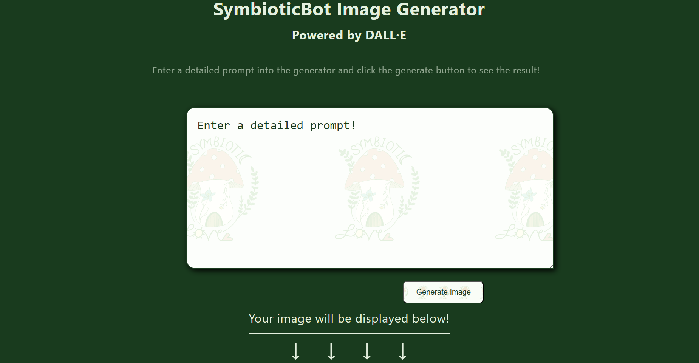

<h1>SymbioticBot imageGenerator React Component Powered by DALL&middot;E</h1>
This is a fully functional react component for our DALLE&middot;E powered image generator. This is posted here mainly for developers to use and for employers to see, as attempting to use it without prior knowledge of 
several systems will be very difficult. It should be fully compatible with all screen sizes, orientations and resolutions. If you have a conflict, reach out to support@symbiotic.love with a report.

&nbsp;

&nbsp;

Soon, it will be integrated with our lite chat bot (hosted at https://github.com/SymbioticLove/Chat-lite, and easier to set up) and hosted on our main site, at which point it will be free and easy for anyone to use.
<h2>Contrary to Our Standard "Do Not Steal" Policy...</h2>
This component is completely open source, and you may use it in any of your projects! We simply ask that you remove our name and colors, which can easily be done by changing the primary/secondary/accent colors at the
:root in the .css file. You will also need to either provide the .css file images (which are marked "INSERT IMAGE HERE"), or delete the references to them. We also did not include any font files or stylings in the .css file or the repository.

&nbsp;

If you want to integrate this component into your React project, you will need an OpenAI API key, and you will need to set an environment variable to 'REACT_APP_OPENAI_API_KEY = "xx-xxxxxxxxxxxxxxxxxxxxxxxxxxxxxxxxx"', 
or you will need to change the references to "REACT_APP_OPENAI_API_KEY" in the .js file to whatever the name for your enviroment variable that contains your API key is.

&nbsp;

If you need an API key, you can get one for free by visiting https://platform.openai.com/, creating an account, and clicking on "View API keys" under your account.
